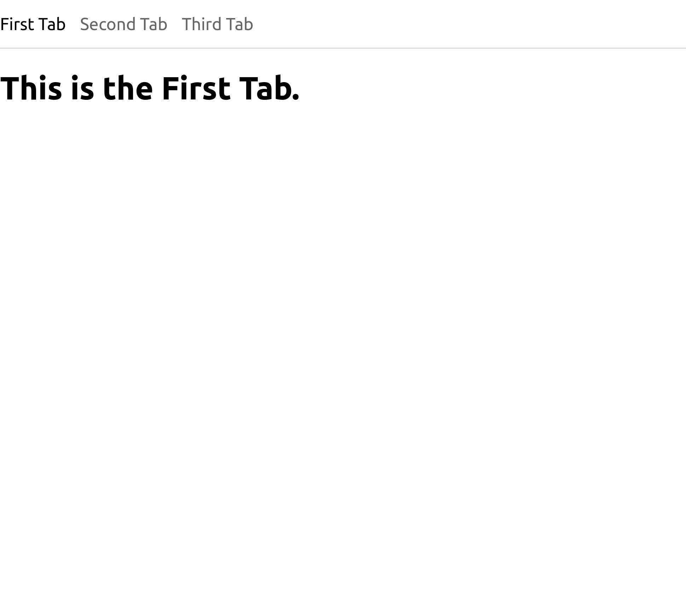

# @nozzlegear/react-win-pivot



## Installation

With [Yarn](https://github.com/yarnpkg/yarn):

```shell
yarn install @nozzlegear/react-win-pivot
```

Or from [NPM](https://npmjs.com/package/@nozzlegear/react-win-pivot):

```shell
npm install @nozzlegear/react-win-pivot --save
```

## Importing

Import the component via ES6 import:

```js
import { Pivot } from "@nozzlegear/react-win-pivot";
// or use default import
import Pivot from "@nozzlegear/react-win-pivot";
```

## Example

```tsx
import * as React from "react";
import { Pivot } from "../index";

type Tab = "First Tab" | "Second Tab" | "Third Tab";

const DEFAULT_TABS: Tab[] = [
    "First Tab",
    "Second Tab",
    "Third Tab",
]

function MyPivotComponent(): JSX.Element {
    const [selectedTab, setSelectedTab] = React.useState(DEFAULT_TABS[0]);

    return (
        <Pivot animate={true} tabs={DEFAULT_TABS} selectedTab={selectedTab} onChange={setSelectedTab}>
            <div>
                <h1>{`This is the ${selectedTab}.`}</h1>
            </div>
        </Pivot>
    )
}
```

## Props

Note: This package has full TypeScript definitions! You should automatically receive intellisense for all of the props documented below:

| Name | Type | Required | Description |
|------|------|----------|-------------|
| `animate` | `boolean` | Required | Indicates that the pivot should animate when it renders and each time the selected tab changes. |
| `animationDuration?` | `number` | Optional, default `200` | The duration of the animation in milliseconds. Only used when `animate` is true. |
| `tabs` | `string[]` | Required | An array of strings to be used as the name of the tabs, e.g. `"Tab 1", "Tab 2"`. |
| `selectedTab` | `string` | Required | The currently selected tab. Must be one of the string values from `tabs`. |
| `onChange` | `(newTab: string) => void` | Required | A function that's called when the user attempts to change the selected tab. Note that this is only a notification that the user wants to change the tab, it will not change itself. |
| `children` | `React.ReactNode` | Required | Content to show in the Pivot's content area. |

## Styling

If you'd like to style the Pivot components yourself, you can change the following CSS variables with your own stylesheet:

| Name | Default value |
| ---- | ------------- |
| `--pivot-tabs-font-family` | `inherit` |
| `--pivot-tabs-font-size` | `24px` |
| `--pivot-tabs-font-color` | `rgba(0,0,0,.6)` |
| `--pivot-tabs-active-font-color` | `#000` |
| `--pivot-tabs-padding` | `20px 20px 20px 0` | 
| `--pivot-tabs-column-gap` | `20px` |
| `--pivot-tabs-border-width` | `0 0 1px 0` |
| `--pivot-tabs-border-style` | `solid` |
| `--pivot-tabs-border-color` | `#ccc` |
| `--pivot-tabs-content-padding` | `0` |
| `--pivot-tabs-slide-in-start-opacity` | `0` |
| `--pivot-tabs-slide-in-end-opacity` | `1` |
| `--pivot-tabs-slide-in-transition` | `all 0.1s ease-in-out` |
| `--pivot-tabs-slide-in-transform` | `translate(0, 0)` |
| `--pivot-tabs-slide-in-from-left-transform` | `translate(-100px, 0px)` |
| `--pivot-tabs-slide-in-from-right-transform` | `translate(100px, 0px)` |
| `--pivot-tabs-slide-in-from-below-transform` | `translate(0px, 100px)` |

Example:

```css
.react-win-pivot {
    /* Change the padding of the tabs list */
    --pivot-tabs-padding: 40px 0;
    /* Change the css transition for animated tabs */
    --pivot-tabs-slide-in-transition: all 0.15s linear;
}
```
